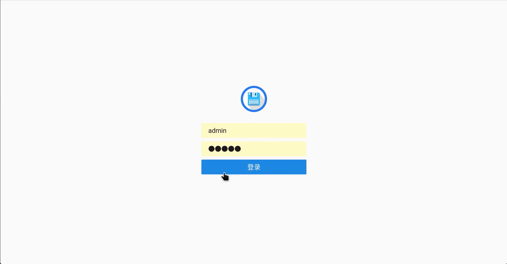

# 中文加强版

## 新增特性

- 优化界面布局，美化界面元素和主题。
- 支持文件外部预览服务期，包括doc、ppt、pdf以及压缩文件的预览。
- 支持文件共享，支持提取码和限时，支持查看访问次数。
- 支持回收站功能。
- 支持收藏夹功能。

## 共享

## 收藏夹

## 回收站

## Install

For installation instructions please refer to our docs at [https://filebrowser.org/installation](https://filebrowser.org/installation).

## Configuration

[Authentication Method](https://filebrowser.org/configuration/authentication-method) - You can change the way the user authenticates with the filebrowser server

[Command Runner](https://filebrowser.org/configuration/command-runner) - The command runner is a feature that enables you to execute any shell command you want before or after a certain event.

[Custom Branding](https://filebrowser.org/configuration/custom-branding) - You can customize your File Browser installation by change its name to any other you want, by adding a global custom style sheet and by using your own logotype if you want.

## Contributing

If you're interested in contributing to this project, our docs are best places to start [https://filebrowser.org/contributing](https://filebrowser.org/contributing).
